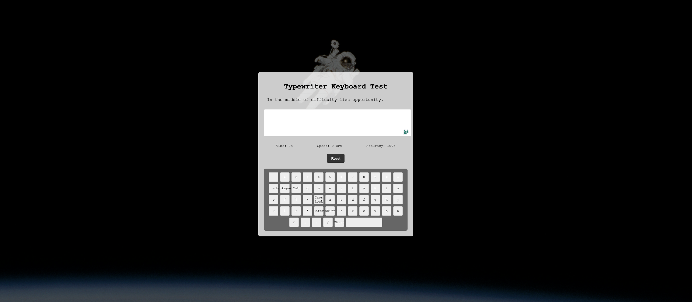

# Typeright Keyboard Test 🚀

A modern, accurate typing speed test application that measures your real typing skills without browser interference.

<<<<<<< HEAD

=======

>>>>>>> d23d33eacd9629e53a8bed83add02e435b2c482f

## ✨ Features

- **Pure Accuracy Testing** - No autocorrect, autocomplete, or spell check interference
- **Real-time Metrics** - Live WPM (Words Per Minute) calculation
- **Accuracy Tracking** - Precise error detection and accuracy percentage
- **Beautiful UI** - Clean, modern interface with space-themed background
- **Visual Keyboard** - On-screen keyboard display
- **Responsive Design** - Works on desktop and mobile devices

## 🎯 Why This Test is Different

Unlike other typing tests, this application disables all browser assistance features:
- `autocorrect="off"` - No automatic correction of typos
- `autocomplete="off"` - No suggestion dropdowns
- `spellcheck="false"` - No red underlines for misspellings

This ensures you're testing your **actual** typing skills, not your browser's assistance.

## 🎬 Demo Video

Here's a showcase of the typing test in action:

https://github.com/user-attachments/assets/Screen%20Recording%202025-06-26%20at%2021.48.56.mov

<video width="800" controls>
  <source src="Screen Recording 2025-06-26 at 21.48.56.mov" type="video/quicktime">
  Your browser does not support the video tag.
</video>

## 🚀 Getting Started

<<<<<<< HEAD
### Option 1: Live Demo (Recommended)
=======
### Option 1: GitHub Pages (Recommended)
>>>>>>> d23d33eacd9629e53a8bed83add02e435b2c482f
Visit the live demo: [https://typeright-keyboard-test.vercel.app/](https://typeright-keyboard-test.vercel.app/)

### Option 2: Local Setup
1. Clone the repository:
   ```bash
   git clone https://github.com/0x3Matt/typeright-keyboard-test.git
   cd typeright-keyboard-test
   ```

2. Open `index.html` in your browser:
   ```bash
   open index.html
   # or
   python -m http.server 8000  # For local server
   ```

## 📁 Project Structure

```
typeright-keyboard-test/
├── index.html      # Main HTML structure
├── style.css       # Styling and animations
├── script.js       # Core functionality and logic
├── space.jpg       # Background image
└── README.md       # This file
```

## 🎮 How to Use

1. **Start Typing** - Click in the text area and begin typing the displayed text
2. **Watch Metrics** - Monitor your WPM, accuracy, and time in real-time
3. **Complete Test** - Finish typing the entire passage
4. **Reset** - Click the reset button to try again with new text

## 🔧 Technical Details

### Core Technologies
- **HTML5** - Semantic structure
- **CSS3** - Modern styling with flexbox and animations
- **Vanilla JavaScript** - No frameworks, pure JS for performance

### Key Features Implementation
- **WPM Calculation**: `(characters typed / 5) / (time in minutes)`
- **Accuracy Tracking**: Real-time comparison of typed vs expected text
- **Error Detection**: Character-by-character validation
- **Timer**: Precise millisecond timing

### Browser Compatibility
- ✅ Chrome 60+
- ✅ Firefox 55+
- ✅ Safari 12+
- ✅ Edge 79+

## 🎨 Customization

### Changing Test Text
Edit the `textSamples` array in `script.js`:
```javascript
const textSamples = [
    "Your custom text here...",
    "Another sample text...",
    // Add more samples
];
```

### Styling
Modify `style.css` to customize:
- Colors and themes
- Font sizes and families
- Layout and spacing
- Animations and transitions

## 📊 Metrics Explained

- **WPM (Words Per Minute)**: Standard typing speed measurement (5 characters = 1 word)
- **Accuracy**: Percentage of correctly typed characters
- **Time**: Elapsed time since first keystroke

## 🐛 Known Issues

- None currently reported

## 🤝 Contributing

1. Fork the repository
2. Create a feature branch: `git checkout -b feature-name`
3. Commit changes: `git commit -am 'Add feature'`
4. Push to branch: `git push origin feature-name`
5. Submit a pull request

## 📝 License

This project is open source and available under the [MIT License](LICENSE).

## 🙏 Acknowledgments

- **Created with [Gemini CLI](https://github.com/google-gemini/gemini-cli/)** - An open-source AI agent that brings the power of Gemini directly into your terminal
- Space background image for the cosmic typing experience
- Inspired by the need for accurate typing tests without browser interference

## 📧 Contact

- GitHub: [@0x3Matt](https://github.com/0x3Matt)
- Repository: [typeright-keyboard-test](https://github.com/0x3Matt/typeright-keyboard-test)

---

**Happy Typing! 🚀**
